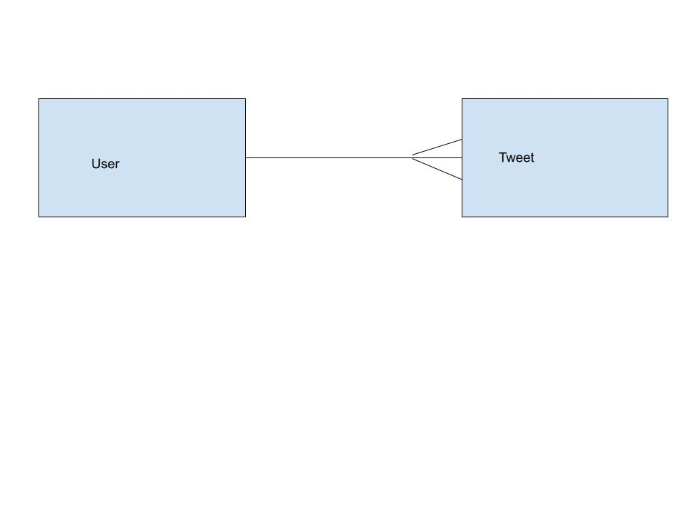

## One to Many Relationships
---

### Learning Goals:

* REVIEW
* Implement one object to many objects relationship
  * One object _has many_ objects
  * One object _belongs to_ another object
* Demonstrate the concept of an Entity Relationship Diagram (ERD, domain model)
* Practice passing custom objects as arguments to methods
* Demonstrate Single Source of Truth
* Infer type of method (class or instance) through naming conventions

### Review

* Quick review of OOP:
 <!-- let's take a poll -->
  * we created classes
  * we created instances of classes using `initialize`
  * we created instance and class methods
  <!-- let's list the macros -->
  * we used `attr_` macros for getters and setters
    - attr_reader: getter method which allows us to read attributes/data/instance variable of an instance
    - attr_writer: setter method which allows us to edit/change/update attributes/data/instance variable of an instance
    - attr_accessor: creates both getter and setter methods (does the job of attr_reader and attr_writer at once!)
  <!-- * let's define self -->
  * we looked at `self`
    - depending on where it is used, self can refer to the instance object or class itself
    - use self at the class level to create a class method
    - explicit self: self.breed
    - implicit self: breed (using attr_reader/attr_accessor to access breed value) 
  * types of variables
    - instance variable (@)
    - class variable (@@)
    - local/regular variable (no special characters)
    - global variable ($)

### Questions
- `attr_` macros: why reader and not accessor
  - `attr_reader`: allows us to read/see data and not to change it
  - `attr_accessor`: allows us to read/see data and to change it
  - `attr_reader :name` -> this is actually a method! `attr_reader(:name, :breed)`
- explicit vs implicit `self` 
  - `self` -> subject of the sentence OR what a method is called on OR whose attributes are gonna matter within a method OR "object of the class" (if it's Dog -> it's the new Dog)
    - Maybe methods are like Genies. The Genie can do all sorts of things for you. But who called the Genie? If Aladdin rubbed the lamp (aka 'called a method') then Aladdin is "self" right now. But when Jafar rubs the lamp (calls a method), then that method is *his* genie now.  Jafar is "self". So who is the one calling the genie (who is the one invoking this method)? That's self.
  
```ruby
  def bark
    puts "#{name} is barking now"
  end
```
  - Rely on Ruby's method lookup chain feature, i.e. `name` would already give us the name

- How do I recognize a class variable? How do I recognize an instance variable?
  - class var: `@@` -> storage room for the entire class; usually you will store the instances;
  - instance var: `@` -> will be carried around with the instance; you should withdraw the data through corresponding methods!
  - regular var: locally-scoped! works inside a method!
- `$global_var` -> available everywhere, usually to store stuff, not to add stuff


### Define

What do the following mean in plain English? What do they mean in programming?

<!-- let's think of the meaning behind the following words -->
* Model
  - diagram (ex: model of a ship)
  - 3D blueprint
* Domain
  - the scope of a process
  - domain name/web address or web id/website/URL
    - google
    - youtube
      - videos (video_file, user_profile, name, genre)
      - add new videos
      - delete videos
    - weather.com
    - espn
* Relationships / associations
  * One to Many relationship
    - one video has many comments, a comment will belong to a video
    - one channel has many videos, one video will belong to a channel
    - customer has many credit cards, one credit card will belong to a customer
    - team has many players, player belongs to a team
    - country has many people/citizens, person/citizen belongs to a country
  * Many to Many relationship
    - customer has many banks, one bank will have many customers

**How to think about relationships**

1. For every one (x), how many (y)? 
2. For every one (y), how many (x)?

_Why do we care so much about codifying and being really specific about the terminology of has-many/belongs-to?_ The terms are very powerful because we can use the same idea to describe relationships across many different types of domains. The relationship between artist and song, is the same as book and author, user and tweets, etc.

* Domain modeling
* Single Source of Truth
  * How can we start thinking about the data in our models?

* ERD: Entity Relationship Diagram
Twitter Clone ERD



### Deliverables

- [ ] Create a User class. The class should have these methods:
  - [x] `User#initialize` takes a username and a bio
  - [x] `User#username` returns a string for the username. _Should not_ be able to change after the user is created.
  - [x] `User#bio` returns a short biography for the user. _Should_ be able to change after the user is created.
  - [x] `User#tweets` returns an array of Tweet instances
  - [x] `User#post_tweet` takes a message, creates a new tweet, and adds it to the user's tweet collection
  - [] *bonus* `User.most_tweets` returns the instance of the user who has made the most tweets

- [x] Create a Tweet class. The class should have these methods:
  - [x] `Tweet#initialize` takes a message and a user instance
  - [x] `Tweet#message` returns a string
  - [x] `Tweet#user` returns an instance of the user class
  - [x] `Tweet.all` returns all the Tweets created.
  - [x] `Tweet#username` returns the username of the tweet's user

### Discussion Questions

- What is a one-many-relationship? How would we draw that in an ERD?
- What does Single Source of Truth mean?
- What is a model? Domain? Domain model?
- What is the relationship between a class and an instance?
